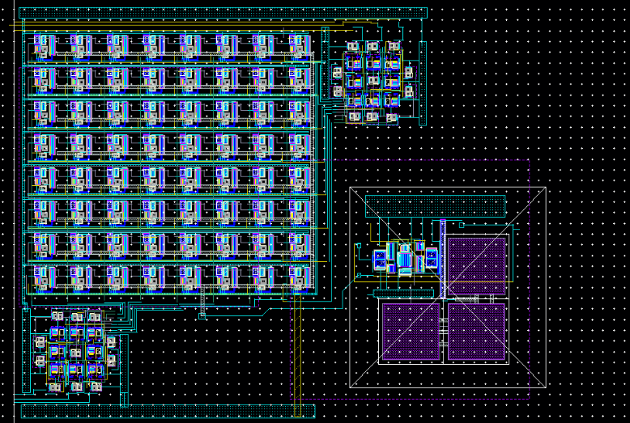

This project was done for EE435 an analog VLSI design class. This final project was a semi openened project to design, simulate, and layout in cadence virtuoso a 6 bit DAC(Digital to Analog Converter) using the strategies we learned in the class. My specific implementation of the design was a string DAC in which I used a somewhat unique method of decoding inorder to simplify layout into easy to connect digital blocks. The design also included a simple 7-Transistor opamp w/wildar current reference as an output stage. The end result I was fairly proud of my basal DAC design, but the Op-amp could have used some further fine tuning and polish. However it fit within the specification of the assignment. Included in this section is my final report for the assignment which contains design, analysis, and simulation results as well as a ZIP file containing the design files which could be viewed using cadence virtuoso. Shown below is the finished layout for the 6bitDAC including the output stage.

